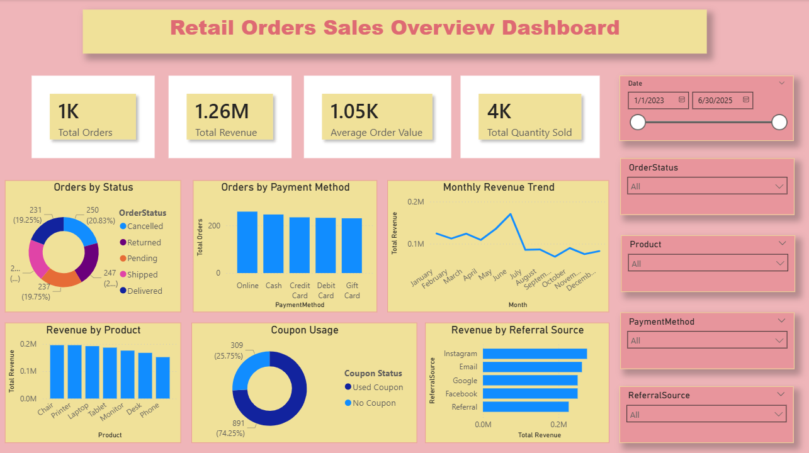
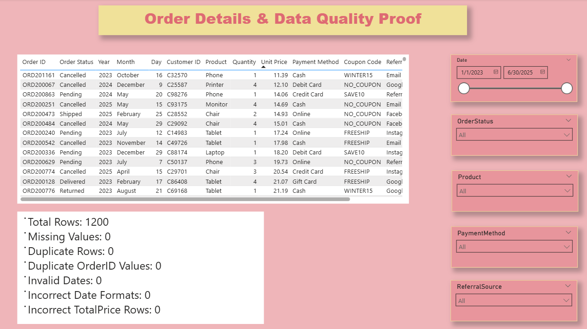

# Retail Orders Data Cleaning & Sales Analysis Project

## Project Overview

This project focuses on cleaning, preparing, storing, analyzing, and visualizing a retail orders dataset.

The main objective of this project is to transform a raw retail orders dataset into a clean, reliable, and analysis-ready dataset. The project includes data auditing, data cleaning, quality validation, SQLite database creation, SQL analysis, and Power BI dashboard development.

This project was completed as a data analytics portfolio project to demonstrate practical skills in data cleaning, data quality checking, SQL analysis, and business intelligence reporting.

---

## Project Objectives

The main objectives of this project are:

- Identify missing or null values
- Check and handle duplicate records
- Validate unique Order ID values
- Standardize date formats
- Clean and standardize text/category columns
- Validate numeric columns
- Check `TotalPrice` using `Quantity × UnitPrice`
- Store the cleaned dataset in a SQLite database
- Perform SQL-based business analysis
- Build an interactive Power BI dashboard
- Document the full project workflow clearly on GitHub

---

## Tools Used

- Python
- Pandas
- JupyterLab
- SQLite
- SQL
- Power BI
- GitHub
- GitHub Desktop

---

## Dataset Description

The dataset contains retail order records with customer, product, payment, coupon, referral, and order status details.

Main columns in the dataset:

| Column          | Description                |
|-----------------|----------------------------|
| OrderID         | Unique order identifier    |
| Date            | Order date                 |
| CustomerID      | Unique customer identifier |
| Product         | Product ordered            |
| Quantity        | Number of units ordered    |
| UnitPrice       | Price per unit             |
| ShippingAddress | Shipping location          |
| PaymentMethod   | Payment method used        |
| OrderStatus     | Current order status       |
| TrackingNumber  | Order tracking number      |
| ItemsInCart     | Number of items in cart    |
| CouponCode      | Coupon used for the order  |
| ReferralSource  | Customer referral source   |
| TotalPrice      | Final order total          |

> Note: This dataset was provided by DecodeLabs as part of the Data Analytics Industrial Training Kit. The dataset is sample/fake data used for learning and portfolio purposes. It does not contain real customer information.
---

## Project Workflow

```text
Raw Dataset
     ↓
Data Audit
     ↓
Data Cleaning
     ↓
Quality Check Proof
     ↓
SQLite Database
     ↓
SQL Analysis
     ↓
Power BI Dashboard
     ↓
GitHub Documentation
```

---

## Folder Structure

```text
Retail-Orders-Data-Cleaning/
│
├── data/
│   ├── raw/
│   │   └── Dataset for Data Analytics.xlsx
│   └── processed/
│       ├── orders_cleaned.csv
│       └── orders_cleaned.xlsx
│
├── notebooks/
│   ├── 01_data_audit.ipynb
│   ├── 03_quality_check.ipynb
│   ├── 04_create_database.ipynb
│   └── 05_sql_analysis.ipynb
│
├── scripts/
│   └── 01_clean_data.py
│
├── database/
│   └── orders_cleaned.sqlite
│
├── sql/
│   ├── schema.sql
│   └── analysis_queries.sql
│
├── powerbi/
│   └── retail_orders_dashboard.pbix
│
├── docs/
│   ├── cleaning_log.md
│   ├── quality_check_summary.csv
│   └── sql_insights.md
│
├── assets/
│   ├── dashboard_overview.png
│   └── order_details_quality.png
│
├── requirements.txt
├── environment.yml
├── LICENSE
└── README.md
```

---

## Data Audit Summary

Before cleaning, the raw dataset was audited to identify data quality issues.

| Check                     | Result |
|---------------------------|-------:|
| Total Rows                | 1200   |
| Total Columns             | 14     |
| Duplicate Rows            | 0      |
| Duplicate OrderID Values  | 0      |
| Missing Values            | 309    |
| Incorrect TotalPrice Rows | 0      |

The main data quality issue found was missing values in the `CouponCode` column.

---

## Main Data Quality Issue

The `CouponCode` column contained missing values.

This was not treated as a serious error because a missing coupon code usually means that the customer did not use a coupon during the order.

Therefore, missing coupon values were replaced with:

```text
NO_COUPON
```

---

## Data Cleaning Actions

| Issue                       | Cleaning Action                           | Reason                                  |
|-----------------------------|-------------------------------------------|-----------------------------------------|
| Missing `CouponCode` values | Replaced with `NO_COUPON`                 | Missing coupon means no coupon was used |
| Duplicate rows              | Checked and removed if found              | Prevent repeated records                |
| Duplicate `OrderID` values  | Checked and removed if found              | Each order must have a unique ID        |
| Date values                 | Standardized to `YYYY-MM-DD` format       | Consistent date analysis                |
| Text/category columns       | Trimmed spaces and standardized text case | Keep categories consistent              |
| Numeric columns             | Converted to correct numeric types        | Ensure valid calculations               |
| `TotalPrice`                | Validated using `Quantity × UnitPrice`    | Confirm order totals are correct        |

---

## Final Data Quality Results

After cleaning, the dataset passed all quality validation checks.

| Quality Check             | Result |
|---------------------------|-------:|
| Total Rows                | 1200   |
| Missing Values            | 0      |
| Duplicate Rows            | 0      |
| Duplicate OrderID Values  | 0      |
| Invalid Dates             | 0      |
| Incorrect Date Formats    | 0      |
| Incorrect TotalPrice Rows | 0      |

The cleaned dataset is now ready for database loading, SQL analysis, and dashboard visualization.

---

## SQLite Database

The cleaned dataset was loaded into a SQLite database.

Database file:

```text
database/orders_cleaned.sqlite
```

Main database table:

```text
cleaned_orders
```

The database was created to make the project more structured and to allow SQL-based analysis using the cleaned dataset.

---

## SQL Analysis

SQL queries were created to analyze the cleaned retail orders data.

Main SQL analysis areas:

- Total orders, total revenue, and average order value
- Orders by order status
- Revenue by product
- Orders by payment method
- Revenue by referral source
- Coupon usage analysis
- Monthly revenue trend
- Customer-level order analysis

SQL queries are available in:

```text
sql/analysis_queries.sql
```

---

## Power BI Dashboard

The Power BI dashboard was created using the cleaned dataset.

The dashboard contains two pages:

1. **Sales Overview**
2. **Order Details & Data Quality Proof**

---

### Sales Overview Dashboard



---

### Order Details & Data Quality Proof



---

## Dashboard Features

The dashboard includes:

- Total Orders KPI
- Total Revenue KPI
- Average Order Value KPI
- Total Quantity Sold KPI
- Orders by Status chart
- Orders by Payment Method chart
- Monthly Revenue Trend chart
- Revenue by Product chart
- Coupon Usage chart
- Revenue by Referral Source chart
- Interactive filters for Date, Order Status, Product, Payment Method, and Referral Source
- Order details table
- Data quality validation summary

---

## Key Results

Final cleaned dataset results:

| Metric                   | Result |
|--------------------------|-------:|
| Total Rows               | 1200   |
| Missing Values           | 0      |
| Duplicate Rows           | 0      |
| Duplicate OrderID Values | 0      |
| Invalid Dates            | 0      |
| Incorrect TotalPrice Rows| 0      |

Dashboard summary:

| Metric              | Result |
|---------------------|-------:|
| Total Orders        | 1K     |
| Total Revenue       | 1.26M  |
| Average Order Value | 1.05K  |
| Total Quantity Sold | 4K     |

---

## How to Run This Project

### Option 1: View the project directly

You can review the cleaned dataset, SQL queries, documentation, and Power BI screenshots directly from this repository.

---

### Option 2: Run the project locally

Clone the repository:

```bash
git clone https://github.com/miuniakarsha/Retail-Orders-Data-Cleaning.git
```

Open the project folder:

```bash
cd Retail-Orders-Data-Cleaning
```

Install required Python packages:

```bash
pip install -r requirements.txt
```

Open JupyterLab:

```bash
jupyter lab
```

Run the notebooks in this order:

```text
01_data_audit.ipynb
03_quality_check.ipynb
04_create_database.ipynb
05_sql_analysis.ipynb
```

---

### Option 3: Run the cleaning script

The cleaning script is available at:

```text
scripts/01_clean_data.py
```

To run it:

```bash
python scripts/01_clean_data.py
```

This script loads the raw dataset, performs cleaning, and saves the cleaned files into:

```text
data/processed/
```

---

### Option 4: Open the Power BI dashboard

Open the following file using Power BI Desktop:

```text
powerbi/retail_orders_dashboard.pbix
```

---

## Documentation Files

Additional project documentation is available in the `docs/` folder.

| File                        | Purpose                                               |
|-----------------------------|-------------------------------------------------------|
| `cleaning_log.md`           | Explains cleaning actions and reasons                 |
| `quality_check_summary.csv` | Stores final quality check results                    |
| `sql_insights.md`           | Explains SQL analysis areas and dashboard preparation |

---

## Project Outcome

This project successfully transformed a raw retail orders dataset into a clean, validated, and analysis-ready dataset.

The final dataset was:

- Audited for data quality issues
- Cleaned using Python and Pandas
- Validated through quality checks
- Stored in a SQLite database
- Analyzed using SQL
- Visualized using Power BI

This project demonstrates that strong data analysis starts with clean, reliable, and well-documented data.

---

## Skills Demonstrated

- Data cleaning
- Data quality validation
- Missing value handling
- Duplicate checking
- Date formatting
- Text standardization
- Numeric validation
- SQLite database creation
- SQL analysis
- Power BI dashboard design
- GitHub project documentation
- Portfolio project presentation

---

## Dataset Source

The dataset used in this project was provided by DecodeLabs as part of the Data Analytics Industrial Training Kit - Project 1: Data Cleaning & Preparation.

The dataset is sample/fake data and is used in this repository for educational and portfolio purposes.

Attribution: DecodeLabs


## Author

**Miuni Akarsha**

GitHub: [miuniakarsha](https://github.com/miuniakarsha)

LinkedIn: [miuniakarsha](http://www.linkedin.com/in/miuniakarsha)